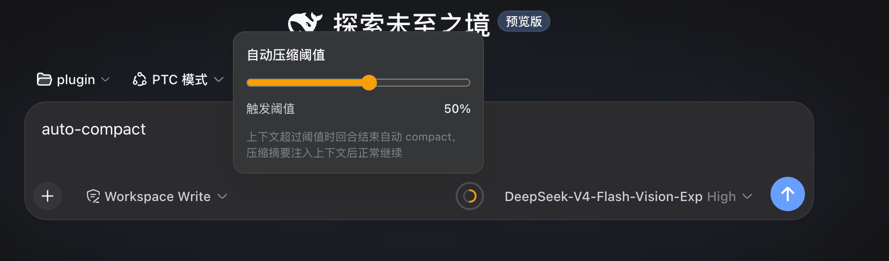

# dsh-auto-compact

[中文](./README.md) · **English**

**A session-level automatic context-compaction plugin for DeepSeek Harness (DSH).**



**dsh-auto-compact** renders a threshold ring to the right of the input area: the current session's context usage is shown in real time, and you can drag a slider to set the compaction threshold for that session (1%–90%, **default 50%**). Whenever usage exceeds the threshold, the plugin automatically triggers a context compaction (compact) — it checks once before every step in a turn and once more when the turn ends — then injects the compacted summary back into the context so the session continues naturally, with no manual intervention and no extra "continue" message.

## Features

- 🔴 **Session-level threshold** — each session is configured independently, persisted by `sessionId`
- 📊 **Real-time usage** — same source as the built-in ContextMeter (`useProjection("contextPressure")`), refreshed live while the panel is open, no polling
- 🎚️ **Fine 1%–90% tuning** — 1% steps for precise control (**defaults to 50% when unset**)
- 🤖 **Fully automatic** — checked before each step in a turn and at turn end → auto-compacts over threshold → summary injected and the turn continues naturally
- 🛡️ **Crash-safe** — all checks run inside `agent/pre-step` (waterfall middleware) and `agent/turn-stopping` (serial event), fully wrapped in try/catch, never throwing
- 💾 **Persistent** — thresholds live in the plugin's own JSON file (`$DSH_HOME/dsh-auto-compact.json`, default `~/.dsh/dsh-auto-compact.json`), surviving restarts
- 🧊 **Coexists with the built-in safety net** — DSH's own `compaction-basic` (default 80% pressure threshold) remains as a fallback, without interference

## Installation

**Prerequisites**: DSH installed and running (`dsh web` works), Node.js ≥ 20, pnpm ≥ 10.

> **Upgrading from the old `auto-compact`**: the old package was named `auto-compact`, the new one is `dsh-auto-compact`. Uninstall the old package first to avoid double-mounting (two Host halves, two rings):
> ```bash
> npx -y --package @deepseek-ai/dsh dsh plugin --profile web remove auto-compact
> ```

### One-shot install (recommended, copy & paste)

**macOS / Linux** (Windows via Git Bash or WSL works too):

```bash
curl -fsSL https://raw.githubusercontent.com/JohnathonYe/auto-compact/main/scripts/install.sh | bash
```

The script handles everything: install npm dependencies → register the official mount (`dsh.profile.bundles`) → clean up leftover mount lines from old versions. All you need to do:

1. Run that single command
2. **Restart DSH** (the script prints the command when done; you can also add `--restart` to auto-restart: `curl ... | bash -s --restart`)
3. Hard-refresh the browser (macOS `Cmd+Shift+R` / Windows·Linux `Ctrl+Shift+R`) — the threshold ring appears to the right of the input area ✅

> The script handles this automatically: `dsh` is usually not on the global PATH (DSH is typically installed via npx, so typing `dsh` directly gives command not found); the script falls back to invoking it via npx, no user action needed.

### Or

```bash
npx -y --package @deepseek-ai/dsh dsh plugin --profile web add dsh-auto-compact
```

After installing you still need to restart DSH and hard-refresh the browser.

### Install from a local checkout (no npm release)

`dsh-auto-compact` is not published to npm yet, so the `dsh plugin --profile web add dsh-auto-compact` command above needs a reachable registry. To run your own checkout, link it into the profile instead:

```bash
git clone https://github.com/JohnathonYe/auto-compact.git
cd auto-compact
npx -y --package @deepseek-ai/dsh dsh plugin --profile web add "$PWD"
```

pnpm registers the profile dependency as `link:`, so editing the code takes effect after a DSH restart with no reinstall; the package's `dsh.bundle.patch` layer is still reconciled into `dsh.profile.bundles`.

### Update / Uninstall

- **Update**: re-run the one-shot install command (or the manual command), then restart DSH and hard-refresh the browser
- **Uninstall**: `npx -y --package @deepseek-ai/dsh dsh plugin --profile web remove dsh-auto-compact`, then restart to take effect; if you manually wrote a mount line in `cordis.patch.yml`, remove it too to avoid double-mounting (two Host halves, two rings)

## Usage

1. Click the ring to the right of the input area to open the panel
2. The panel shows the current session's real-time context usage (percentage)
3. Drag the slider to set the threshold (1%–90%, per-session independent; **new sessions default to 50%** until you drag, affecting only the current session, not others)
4. From then on, whenever usage exceeds the threshold (before a step in a turn, or at turn end), the plugin automatically compacts and continues

## How it works

- **Host half** (`lib/index.js`): listens for `agent/pre-step` (before each step in a turn, waterfall middleware) and `agent/turn-stopping` (turn end, serial event), reads the current session threshold and usage (`tokenMeter.measure()` / `contextPressure` projection), and when over threshold calls `agentPresets.serviceFor(agent, 'compaction').compactIfNeeded(agent, 'context-overflow', signal)` to compact — taking the context-overflow path, bypassing the engine's own 0.8 threshold check, fully controlled by the slider.
- **Client half** (`lib/client.js`): registers the ring UI in the `conversation.input.right` slot; the threshold is read/written via a custom webServer route `/dsh-auto-compact/api` (host side reads and writes the JSON store above); usage comes from the real-time `useProjection("contextPressure")` projection.

## Dependencies

- Requires DSH's `compaction-basic` (`@deepseek-ai/dsh-compaction-basic`) to be enabled — included in the default presets (standard / code / cordis), except the `minimal` preset
- All peer dependencies ship with DSH; nothing extra to install

## License

MIT
